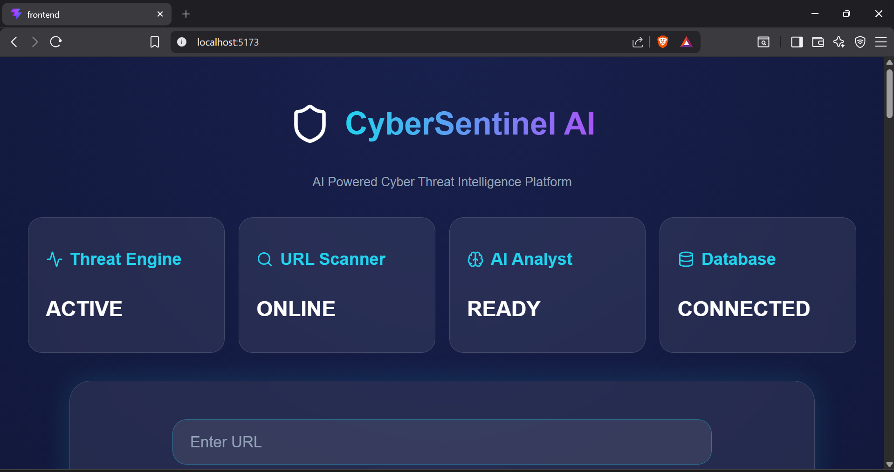
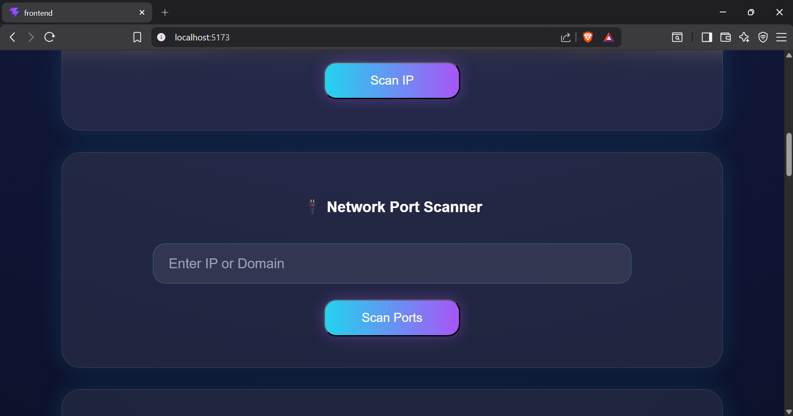
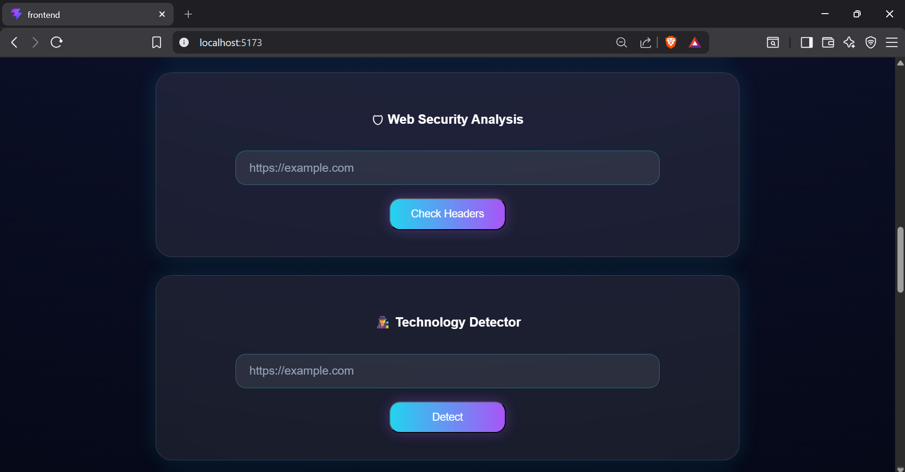
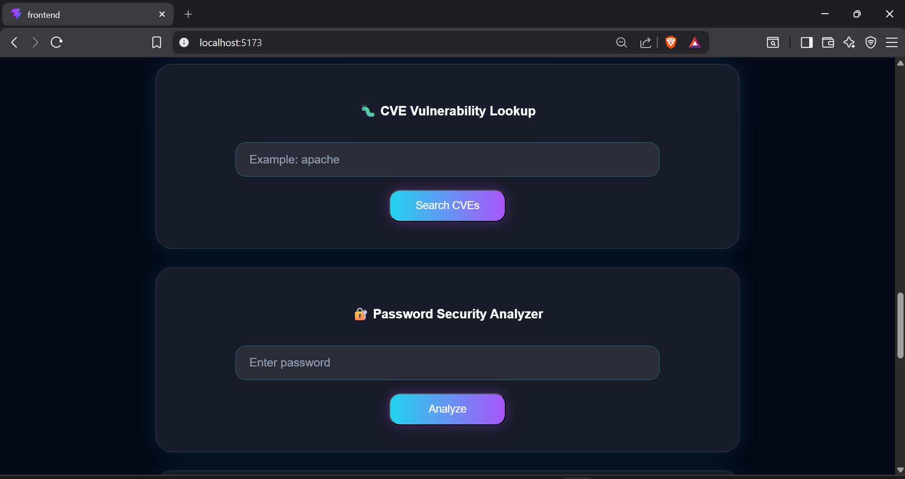
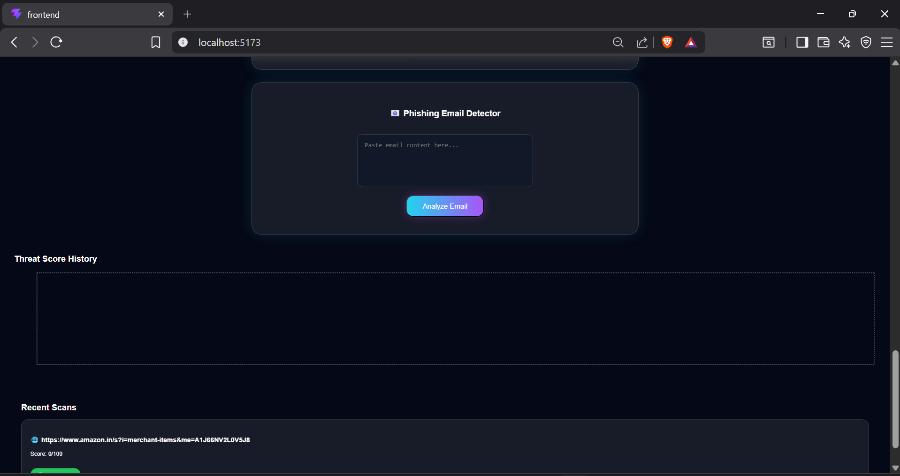
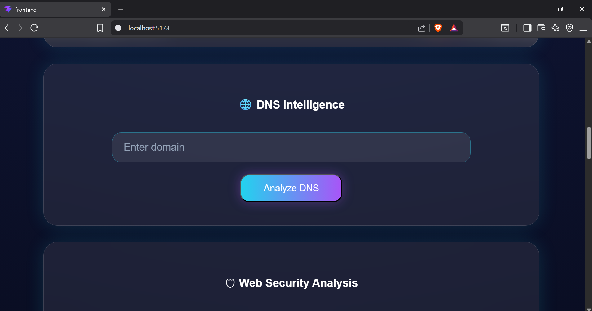
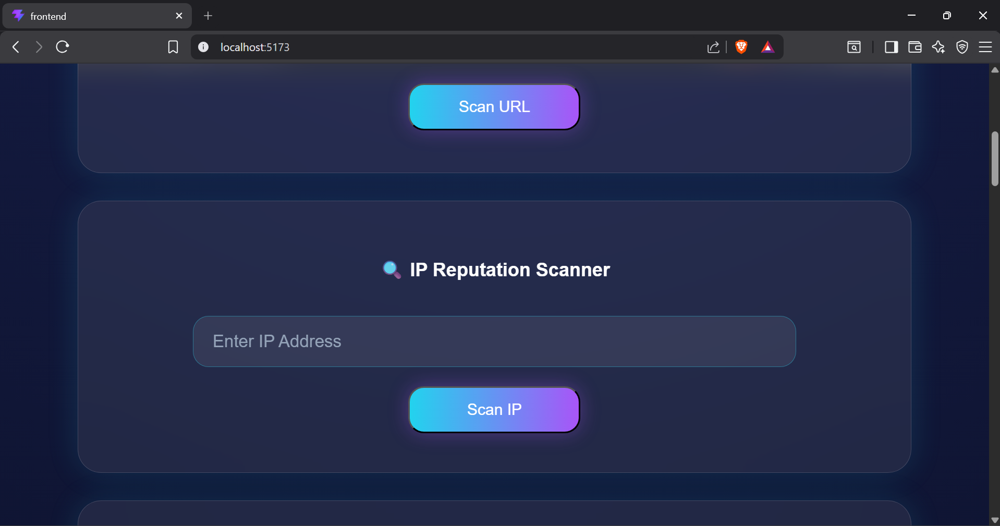
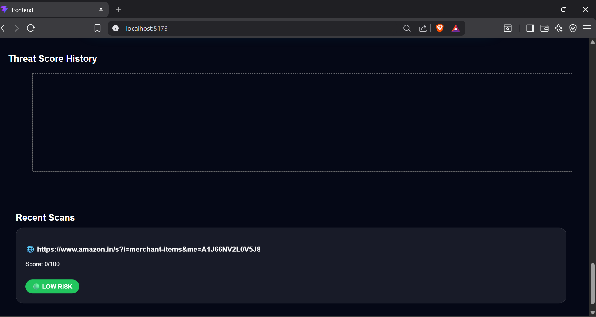

# 🛡️ CyberSentinel AI

> **AI-Powered Web Security Assessment & Threat Intelligence Platform**

CyberSentinel AI is a full-stack cybersecurity platform that combines traditional web security scanning with **AI-powered analysis using Ollama**. It enables users to perform reconnaissance, vulnerability assessment, technology detection, and threat analysis from a single, modern dashboard.

The application integrates automated security tools with a locally hosted Large Language Model (LLM) through **Ollama**, allowing users to understand vulnerabilities and receive intelligent remediation recommendations while keeping all AI processing local.

---

# ✨ Features

- 🤖 AI Security Analyst (Powered by Ollama)
- 🌐 URL Security Scanner
- 🔎 Website Technology Detection
- 🔌 Network Port Scanner
- 🛡️ CVE Detection & Analysis
- 🎣 Phishing Detection
- 🌍 DNS Lookup
- 🌐 IP Intelligence Scanner
- ⚠️ URL Reputation & Blacklist Checking
- 📊 Threat History Dashboard
- 💡 AI-Powered Remediation Recommendations

---

# 🛠️ Tech Stack

## Frontend
- React
- Vite
- Tailwind CSS
- Axios

## Backend
- Node.js
- Express.js

## AI
- Ollama
- Local Large Language Model (LLM)

## Cybersecurity
- Nmap
- CVE APIs
- URL Reputation APIs
- DNS Resolution
- HTTP Requests

---

# 📂 Project Structure

```
CyberSentinel-AI/
│
├── frontend/
├── backend/
├── screenshots/
├── README.md
├── LICENSE
└── .gitignore
```

---

# 🏗️ Architecture

```
                 Target URL
                      │
                      ▼
             URL Security Scanner
                      │
      ┌───────────────┼────────────────┐
      ▼               ▼                ▼
Technology      Port Scanner      DNS/IP Lookup
Detection
      │               │                │
      └───────────────┼────────────────┘
                      ▼
       CVE & Reputation Analysis
                      ▼
        Ollama AI Security Analyst
                      ▼
      Risk Assessment & Remediation
                      ▼
       Interactive Security Dashboard
```

---

# 🚀 Installation

## Clone Repository

```bash
git clone https://github.com/phoenix19-h/CyberSentinel-AI.git
```

## Backend

```bash
cd backend
npm install
npm start
```

## Frontend

```bash
cd frontend
npm install
npm run dev
```

Open:

```
http://localhost:5173
```

---

# 📸 Screenshots

## Dashboard



---

## Port Scanner



---

## Website Technology Detection



---

## CVE Detection



---

## Phishing Detection



---

## DNS Lookup



---

## IP Intelligence



---

## Threat History



---

# 🤖 AI Security Analysis

CyberSentinel AI leverages **Ollama** to enhance traditional security scanning by providing intelligent analysis of scan results.

The AI assistant can:

- Explain detected vulnerabilities.
- Analyze security findings.
- Recommend remediation steps.
- Provide contextual security insights.
- Perform local AI analysis without cloud services.

---

# 🎯 Learning Outcomes

This project strengthened my practical understanding of:

- Web Application Security
- Vulnerability Assessment
- Network Reconnaissance
- CVE Analysis
- Phishing Detection
- REST API Development
- Full-Stack Development
- React & Node.js
- AI-assisted Security Analysis

---

# 🚀 Future Improvements

- SSL/TLS Certificate Analysis
- HTTP Security Header Analysis
- Export Reports (PDF/CSV)
- User Authentication
- Scheduled Automated Scans
- Docker Deployment
- CI/CD Pipeline

---

# 📄 License

This project is licensed under the **MIT License**.

---

# 👨‍💻 Author

**Harnoor Kaur**

- GitHub: https://github.com/phoenix19-h

---

⭐ If you found this project useful, consider giving it a **Star** on GitHub!